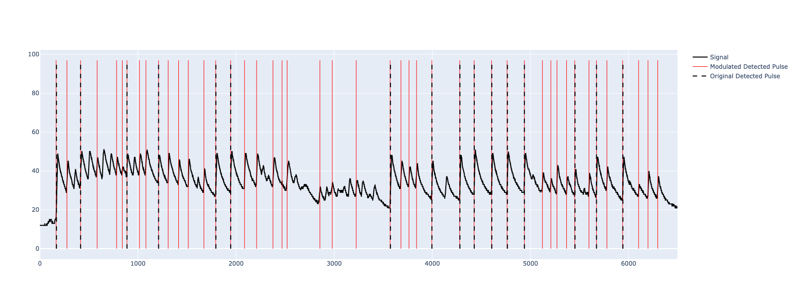

# Example Usage
Comparing the a simple diff thresholding with difference thresholding modulated by the model.

Note the likelihoods arent a coherent distribution, each likelihood is $L(t^{'})_{\tau}$, where $\tau$ represents the last update to the state

